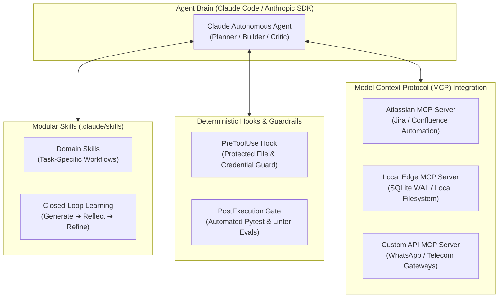
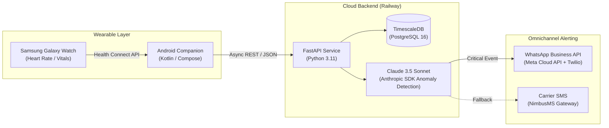
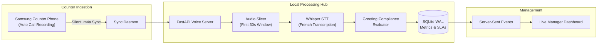
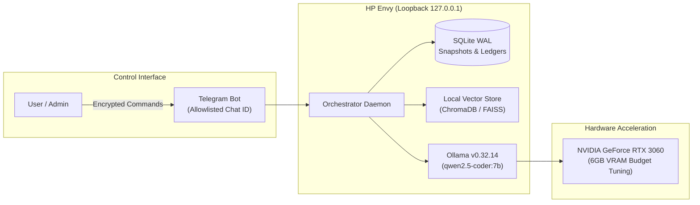

# Hi, I'm Abdoulaye Sow 👋
### AI Product Manager · Founder · Hands-On Systems Builder

 

**I build AI products and put them in front of real users myself.**  
*13+ years in software engineering and product leadership, turning loose hypotheses into live, production-grade systems.*

 

[🧠 Claude & Agents](#-the-core-superpower-claude-agentic-engineering--mcp) • [⚡ Overview](#-what-i-bring-to-the-table) • [🏗️ Architectures](#️-featured-system-architectures) • [🌟 Public Repos](#-featured-open-source-repositories) • [🧰 Tech Stack](#-technical-arsenal) • [📜 Credentials](#-certifications--credentials) • [📬 Contact](#-get-in-touch)

---

### 🔭 Currently Focused On
* 🧠 **Local AI & Air-Gapped Inference:** Architecting private on-metal agentic workflows with **Ollama (`qwen2.5-coder`) accelerated on NVIDIA RTX 3060 GPUs**.
* 🎙️ **Voice Telephony & Latency:** Real-time telephony state machines, Whisper speech-to-text audio pipelines, and conversational scoring.
* 💬 **Ask me about:** 0→1 AI product incubation, Model Context Protocol (MCP) servers, WhatsApp conversational agents, and low-resource multilingual NLP.

---

### ⚡ What I Bring to the Table

- 🚀 **Founder Mentality (0→1 Execution):** Founded Improve So and Friasoft. Built **Pulse** from a loose problem to a live B2B SaaS subscription product with 5 paying clients.
- 🛠️ **Build Agents, Not Just Specs:** I don't stop at PRDs. I prototype and deploy hands-on using **Claude Code, the Anthropic SDK, and Model Context Protocol (MCP) servers**.
- 🏢 **Enterprise Global Scale:** AI Delivery & Platform Lead across a global footprint of **40,000+ retail locations**, shipping 5 production AI agents on Atlassian MCP servers and cutting manual testing by 70%.
- 🧠 **On-Metal Local AI & Hardware:** Architect of high-performance local AI and VLM stacks on **NVIDIA GeForce RTX 5080 (16GB) and RTX 3060 GPUs** using Ollama for air-gapped privacy and cross-continental edge compute.
- 🔬 **Published ML Researcher:** Author of [*Machine Translation for Nko: Tools, Corpora and Baseline Results*](https://arxiv.org/abs/2310.15612) (arXiv:2310.15612), advancing NLP for low-resource West African languages.

---

### 🧠 The Core Superpower: Claude Agentic Engineering & MCP

> *"Most engineers use LLMs as basic autocomplete. I harness Claude as a full multi-agent engineering department."*

I specialize deeply in the **Anthropic Claude Ecosystem**—moving beyond naive chat prompts into architecting closed-loop, deterministic multi-agent systems with **Claude Code, the Anthropic SDK, Model Context Protocol (MCP), and custom Skills & Hooks**:

#### How I Architect with Claude:
* 🧩 **Modular Skills (`SKILL.md`):** Authoring domain-specific, on-demand capability packages that agents invoke dynamically based on intent, enabling complex multi-step workflows without token bloat.
* 🛡️ **Deterministic Hooks & Validation Gates:** Combining probabilistic LLM reasoning with strict programmatic guardrails (PreToolUse security filters, automated test suites, and schema validators) so agents never commit broken code or leak credentials.
* 🔌 **Model Context Protocol (MCP) Servers:** Engineering custom MCP servers that expose real-world systems (Atlassian Jira, SQLite databases, hardware sensors, and telecom APIs) directly into Claude's tool-calling space.
* 🔄 **Closed-Loop Self-Improvement:** Building self-refining agent trajectories where agents mine past execution logs and failures to iteratively refine their own skill definitions.

---

### 🏗️ Featured System Architectures

#### 🩺 Bip'AI — Wearable Health Sentinel *(HealthTech & Biometrics)*
> An AI-powered health sentinel that turns consumer smartwatches into proactive vitals monitoring for families and the diaspora.

<b>🔍 Click to view Bip'AI Architecture & Engineering Details</b>

 

* **Biometric Ingestion:** Captures high-frequency time-series heart rate and vital telemetry from Galaxy Watch sensors using Android Health Connect.
* **Storage & Aggregation:** Ingests readings into PostgreSQL 16 with **TimescaleDB hypertables** for rolling window analysis and time-series aggregation.
* **LLM Health Interpretation:** Anthropic Python SDK prompts analyze multi-hour vital trends to distinguish false spikes from true cardiovascular anomalies.
* **Resilient Multi-Provider Routing:** Automated fallback: Meta Cloud API $\to$ Twilio WhatsApp $\to$ NimbusMS SMS for guaranteed delivery in low-connectivity markets.

---

#### 🎙️ O'Takos Voice Hub — Conversational Telephony Intelligence *(Voice AI / Retail)*
> Offline-first call analytics engine capturing retail dining orders and enforcing greeting compliance standards in real time.

<b>🔍 Click to view Voice Hub Telephony State Machine Details</b>

 

* **Telephony State Machine:** Explicit event lifecycle management (`RINGING` $\to$ `ANSWERED` / `MISSED` $\to$ `ENDED`) to calculate ring latency ($T_{\text{answered}} - T_{\text{ringing}}$) and alert on 15s SLA breaches.
* **Speech-to-Text & French Evaluation:** Automated transcription using OpenAI Whisper, scoring salutations, brand mentions, and courteous phrasing with strict privacy number masking (`+224 621 ** ** 56`).
* **Offline-First Resilience:** Operates locally on SQLite WAL mode with real-time UI updates via Server-Sent Events (SSE).

---

#### 🔒 Hermes — Air-Gapped Local AI Stack *(On-Metal Privacy & Hardware)*
> 100% private, zero-data-leakage autonomous assistant and second brain running on local NVIDIA hardware.

<b>🔍 Click to view Hermes On-Metal Hardware & Security Architecture</b>

 

* **Hardware & VRAM Allocation:** Engineered to run 100% locally on an **NVIDIA GeForce RTX 3060 Laptop GPU (6GB VRAM)** using Ollama v0.32.14 serving `qwen2.5-coder:7b`, carefully tuned to maximize context window while staying within the 6GB hardware boundary.
* **Air-Gapped Privacy & Zero Leakage:** Enforces a strict loopback security baseline (`127.0.0.1:11434`). Sensitive documents, personal finances, and proprietary logs never leave the machine or touch third-party cloud APIs.
* **Local RAG & Second Brain:** Ingests unstructured Markdown notes and SQLite databases into local vector embeddings (**ChromaDB / FAISS**) for semantic retrieval and context-aware Q&A.
* **Telegram Control Plane:** Secure, rate-limited, allowlisted Telegram bot as the sole interaction interface, driving operational modules:
  * 🎯 **Career Copilot:** Parses job application logs, computes follow-up deadlines, and runs stateful mock interview sessions.
  * 💰 **Financial Ledger:** Natural language expense logging and fund tracking.

---

### 🌟 Featured Open-Source Repositories (Public Code)

Directly explore and clone my public codebases:

| Repository | Tech Stack | Highlights |
| :--- | :--- | :--- |
| 🏷️ **[`deal-buddy-ai-powered-app-0012-2026`](https://github.com/abdoulayesow/deal-buddy-ai-powered-app-0012-2026)** | Claude AI · TypeScript | AI-powered deal finder and price intelligence assistant. |
| 📊 **[`digital-ledger-for-small-store-0011-2026`](https://github.com/abdoulayesow/digital-ledger-for-small-store-0011-2026)** | TypeScript · Claude Code | Offline-first digital bookkeeping ledger designed for small merchants. |
| 💬 **[`whatsapp-notifier-utility-008-2026`](https://github.com/abdoulayesow/whatsapp-notifier-utility-008-2026)** | TypeScript · Vitest | Resilient notification utility and dispatch worker for messaging workflows. |
| 🚗 **[`ride-app-guinea-project-007-2025`](https://github.com/abdoulayesow/ride-app-guinea-project-007-2025)** | Full-Stack | Ride-hailing application designed for emerging market operational realities. |
| 🧠 **[`learn-ai-skill-with-anthropic`](https://github.com/abdoulayesow/learn-ai-skill-with-anthropic)** | Anthropic SDK · Python | Hands-on patterns for tool use, prompt chaining, and Claude Skills. |
| 🧪 **[`ai-antigravity-testing-and-learning`](https://github.com/abdoulayesow/ai-antigravity-testing-and-learning)** | Python · Pytest | Multi-agent orchestration and automated tool testing harness. |
| 📑 **[`slide-dev-experiment-003-2026`](https://github.com/abdoulayesow/slide-dev-experiment-003-2026)** | Slidev · HTML | Automated interactive presentation generator for PSM I training courses. |

---

### 🧰 Technical Arsenal

#### AI, Models & Agent Frameworks

-10B981?style=for-the-badge&logo=codeforces&logoColor=white)
-000000?style=for-the-badge&logo=ollama&logoColor=white)

#### Languages & Backends

-7F52FF?style=for-the-badge&logo=kotlin&logoColor=white)

#### Databases & Cloud Platforms

#### Messaging, Hardware & Telephony

---

### 📊 GitHub Activity & Metrics

 

---

### 📜 Certifications & Credentials

* 🏅 **Anthropic Foundations Associate** (2026)
* 🏅 **Scrum Product Owner AI Essentials** (2026)
* 🏅 **PSPO II** — Professional Scrum Product Owner II (2025)
* 🏅 **PAL-EBM** — Professional Agile Leadership, Evidence-Based Management (2024)
* 🏅 **SAFe SPC6 AI Empowered** — Scaled Agile Program Consultant (2018 / 2026)
* 🎓 **Master of Engineering, Industrial & Computer Engineering** — *Polytech' Marseille, France* (2013)

---

### 📬 Get in Touch

* 💼 **LinkedIn:** [linkedin.com/in/abdoulaye-sow-44861633](https://linkedin.com/in/abdoulaye-sow-44861633)
* 📧 **Email:** [abdoulaye.sow.co@gmail.com](mailto:abdoulaye.sow.co@gmail.com)
* 🌐 **Location:** Houston, TX area · *Open to Relocation (Austin, SF, Seattle, NYC) & Remote*

---

  Built with high-agency hands-on execution. Always shipping.

